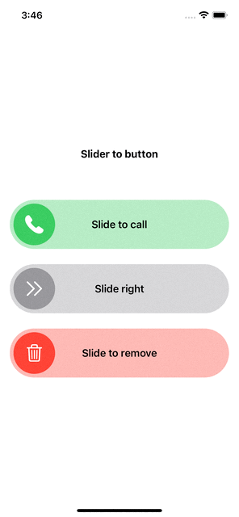

# Fancy sliders

## Example

To run the example project, clone this repo, and open iOS Example.xcworkspace from the iOS Example directory.

## Requirements

## Installation

Add this to your project using Swift Package Manager. In Xcode that is simply: File > Swift Packages > Add Package Dependency... and you're done.

## Author

__Elhoucine Ayoub__
