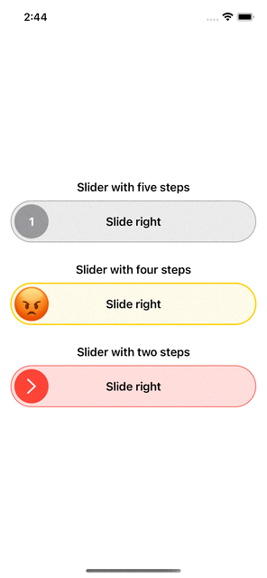

# Fancy sliders

     

## Installation

Add this to your project using Swift Package Manager. In Xcode that is simply: File > Swift Packages > Add Package Dependency https://github.com/ayoubElhoucine/FancySliders-iOS.git and you're done.

## Usage
### Slider to button exambple:

           
            @State private var thumbColor = Color.green
            SliderToButton(
                width: UIScreen.main.bounds.width - 32, 
                height: 80, 
                title: "Slide to call", 
                titleColor: .black, 
                bgColor: thumbColor.opacity(0.4),
                initialMode: .slider // (.slider/.button) in case you need it to a button as first just set initialMode to .Button
            ) {
                // thumnail view factory: you can customize the thumb view depends on your need
                Circle()
                    .fill(thumbColor)
                    .padding(6)
                    .overlay {
                        Image(systemName: "phone.fill")
                            .resizable()
                            .foregroundColor(.white)
                            .scaledToFit()
                            .frame(width: 30)
                    }
                
            } didFinishSliding: {
                // call back for finish sliding
                withAnimation {
                    thumbColor = .red
                }
            } didClick: {
                // callback for button state click
                withAnimation {
                    thumbColor = .green
                }
            }
            
            
### Switch Slider exambple:

            SwitchSlider(
                width: UIScreen.main.bounds.width - 60, 
                height: 80, 
                title: "Switch On",
                titleColor: .black, 
                colorOn: .green, 
                colorOff: .red.opacity(0.3)
            ) {
                // thumnail view factory: you can customize the thumb view depends on your need
                Circle()
                    .fill(.white)
                    .padding(6)
                    .overlay {
                        Image(systemName: "power")
                            .resizable()
                            .foregroundColor(.green)
                            .scaledToFit()
                            .frame(width: 30)
                    }
            } didComplete: { value in
                // value will be true or false
            }

### Steps Slider exambple:

            StepSlider(
                width: UIScreen.main.bounds.width - 32, 
                height: 60, 
                stepCount: 2 // number of steps
            ) {
                // thumnail view factory: you can customize the thumb view depends on your need
                Circle()
                    .fill(.red)
                    .padding(5)
                    .overlay {
                        Image(systemName: "chevron.right")
                            .resizable()
                            .scaledToFit()
                            .foregroundColor(.white)
                            .frame(height: 22)
                    }
            } content: {
                // content view factory: you can customize the content view depends on your need
                Capsule().fill(Color.red.opacity(0.2))
                    .overlay {
                        Capsule().stroke(.red, lineWidth: 1)
                        Text("Slide right").fontWeight(.semibold)
                    }
            } onSliding: { value in
                // trigered when user is on sliding, the value will be int from 0 to (stepCount - 1)
            } didComplete: { value in
                // trigered when user finish sliding, the value will be int from 0 to (stepCount - 1)
            }

### Steps Slider exambple:
you need to add the images to assets package and use them in images, you need five images that will represent your rating from one to five star

            RatingSlider (
                width: UIScreen.main.bounds.width - 32,
                height: 58,
                images: RatingImages(firstImage: "emoji-1", secondImage: "emoji-2", thirdImage: "emoji-3", fourthImage: "emoji-4", fifthImage: "emoji-5")
            ) {
                // content view factory: you can customize the content view depends on your need
                ZStack {
                    Capsule().fill(.yellow.opacity(0.2))
                        .overlay {
                            Capsule().stroke(.yellow, lineWidth: 2)
                        }
                    Text("Rate your experience!")
                        .foregroundColor(.black)
                }
            } didRate: { value in
                // trigered when user finish rating, the value will be int from 0 to 4
            }

## Author

__Elhoucine Ayoub__
